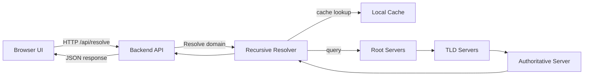
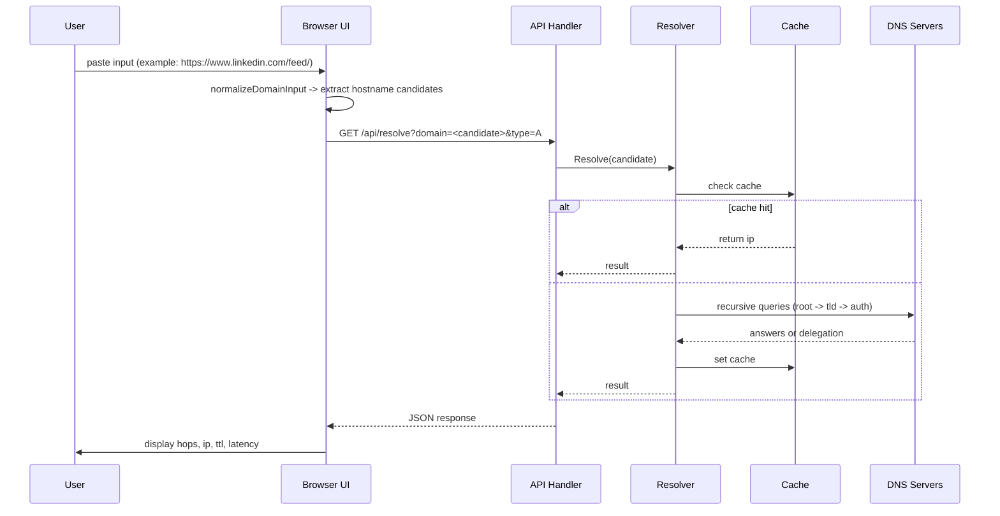

# ResolveX

ResolveX is a lightweight recursive DNS resolver with a web dashboard for tracing and inspecting DNS lookups. It accepts user-provided host inputs (including pasted URLs), normalizes the input into host candidates, performs recursive DNS resolution (optionally via a specified upstream server), and displays resolution hops, latency, and cache state.

## Table of contents

- [Architecture overview](#architecture-overview)
- [Request and response flow](#request-and-response-flow)
- [Learning outcomes](#learning-outcomes)
- [Setup and quick start](#setup-and-quick-start)
- [API](#api)
- [Implementation details](#implementation-details)
- [Development and testing](#development-and-testing)
- [Contributing](contributing.md)
- [License](LICENSE)

## Architecture overview



## Request and response flow



## Learning outcomes

This project also includes a separate learning summary covering DNS, TCP, TLS, CDNs, and modern web routing. See [learning.md](learning.md).

## Setup and quick start

Prerequisites

- Go 1.20+ for the backend
- Node 18+ and npm for the frontend

Backend quick start

```bash
cd backend
go test ./...       # run tests
go build ./cmd/server
./server            # or run via `go run ./cmd/server` for development
```

Frontend quick start

```bash
cd .
npm install
npm run dev         # start Vite dev server
npm run build       # produce production assets
```

Running the full app (recommended for development)

1. Start backend server (default port configured in the project). 2. Start frontend dev server. 3. Open the dashboard at the frontend URL.

## Deployment

- **Frontend (Vite)**
  - Set the production API base at build time using the Vite env var `VITE_API_BASE_URL`. Example value: `https://resolvex-2ly7.onrender.com`.
  - Local build example: create a file named `.env.production` at the project root containing:

    ```env
    VITE_API_BASE_URL=https://resolvex-2ly7.onrender.com
    ```

  - When using Render (static site), add an Environment Variable named `VITE_API_BASE_URL` with the above value in the service settings before running the build.
  - Build the frontend as usual with `npm run build`. The frontend falls back to `window.location.origin` if `VITE_API_BASE_URL` is not set.

- **Backend (Go API)**
  - The backend respects the `PORT` environment variable commonly provided by platforms like Render. If unset, it falls back to its default port (see `backend/cmd/server`). Ensure your service sets `PORT` to the value Render (or another host) expects.
  - Recommended: expose a lightweight health endpoint at `/health` that returns `200 OK` for liveness/readiness checks. The server already supports this endpoint in `backend/internal/api` (or add it to `cmd/server` if missing).
  - Start command examples:

    ```bash
    # run the built server binary
    ./server

    # or run directly for quick deploys (not recommended for production):
    go run ./cmd/server
    ```

  - For Render (service): set the Start Command to `./server` (or `go run ./cmd/server` for a pull-build-deploy setup), and ensure the `PORT` env var is configured by Render (Render usually injects `PORT` automatically).

- **Notes**
  - Make sure the frontend `VITE_API_BASE_URL` matches the backend base URL (including scheme `https://`). When using a static frontend hosting platform, set that env var in the host's build settings so the compiled assets call the correct API.

## API

Endpoint: GET `/api/resolve`

Query parameters

- `domain` (required) - Host or pasted URL to resolve. The system extracts hostname candidates automatically.
- `type` (optional) - DNS query type. One of `A`, `AAAA`, `MX` or numeric type; defaults to `A`.
- `server` (optional) - Upstream DNS server (host or host:port). If omitted, resolver uses configured root servers.

Response (JSON) - `models.DnsResponse` includes

- `domain` - canonical domain used
- `server` - upstream server that provided the final answer (or configured server)
- `queryType` - resolved record type
- `ip` - final resolved address (or empty)
- `cacheHit` - boolean
- `ttl` - time to live
- `latency` - total resolution time in milliseconds
- `hops` - ordered list of hops containing `server` and `time` fields

Example

```text
GET /api/resolve?domain=https://www.linkedin.com/feed/&type=A

Response: { "domain":"www.linkedin.com", "ip":"...", "hops":[...], "cacheHit":false }
```

## Implementation details

- Input normalization
  - Frontend: `src/App.tsx` provides `normalizeDomainInput` which trims input, uses a hostname regex fallback, and tries `URL` parsing. It returns the first valid hostname extracted.
  - Backend: `backend/internal/resolver/recursive.go` provides `normalizeDomainCandidates` which returns an ordered list of host candidates (keeps `www.` as primary, then apex as fallback). The `Resolve` function will attempt these candidates sequentially.

- Recursive resolution
  - `Resolve` performs cache lookup, then an iterative recursive query loop. Each iteration queries a set of servers, inspects answers for final records, CNAMEs, and next-NS delegations, and continues until resolved or exhausted.
  - On CNAME, the resolver restarts at root servers for the new canonical name to ensure correct authoritative resolution.

- DNS message handling
  - Queries are constructed with `dns.Fqdn(domain)` and dispatched via `dns.Client.Exchange` in `backend/internal/resolver/query.go`.
  - Parsing helpers in `backend/internal/resolver/parser.go` extract A/AAAA/MX values and CNAME targets.

- Cache
  - The in-memory cache stores entries with TTL and type. Cache hits return immediately to speed responses.

## Development and testing

- Run backend tests

```bash
cd backend
go test ./...
```

- Run frontend type-check and build

```bash
npm run build
```

- Tests to look at
  - `backend/internal/resolver/recursive_test.go` - normalization and candidate ordering tests

## Contributing

Contribution guidelines are documented in [contributing.md](contributing.md).

## License

This project is licensed under the MIT License. See [LICENSE](LICENSE).